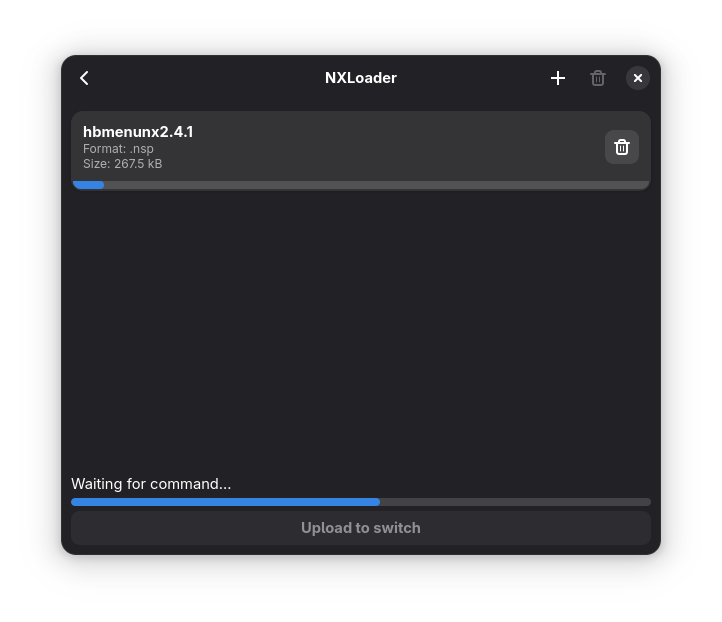

# NXLoader

A gtk app for installing switch games

## TODO
rewrite into another language

## Preview




## Known bugs
This bugs may not be fixed cuz i don't know what is causing them
- Sometimes the progress bars are not in sync (eg: the progress bar of the only rom item in the box not in sync with the total progress bar)
- If an error ocurrs before sending the roms, the next try will fail due to an overflow

## Installing
### General
#### Dependencies (archlinux names)
- `python3`
- `python-gobject`
- `python-pyusb`
- `python-pip`
- `meson`
- `ninja`
- `pkg-config`
- `gtk4`
- `libadwaita`
- `libgudev`
- `blueprint-compiler`
- `nxroms`

You can get `nxroms` [here](https://github.com/XtremeTHN/NXLoader)

#### Installing

```
meson setup build
meson -C build install
```

### NixOS
Add this repo to your inputs
```nix
# flake.nix
inputs.nxloader.url = "github:XtremeTHN/NXLoader";
```
Then add the input to your packages
```nix
{ ... } @inputs: let
    system = "x86_64-linux";
in {
    home.packages = [
        inputs.nxloader.packages.${system}.default
    ];
}
```

