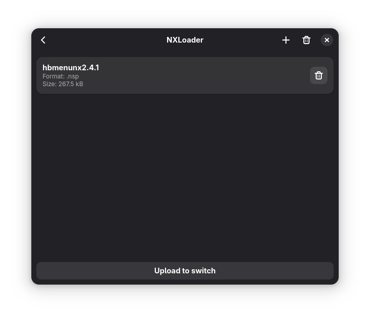

# NXLoader

A gtk app for installing switch games

## Preview



## Installing
### General
```
meson setup build
meson -C build install
```

### NixOS
Add this repo to your inputs
```nix
# flake.nix
inputs.nxloader.url = "github:XtremeTHN/NXLoader";
```
Then add the input to your packages
```nix
{ ... } @inputs: let
    system = "x86_64-linux";
in {
    home.packages = [
        inputs.nxloader.packages.${system}.default
    ];
}
```
